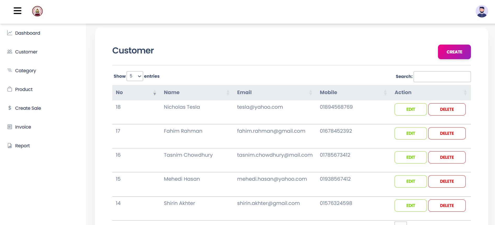
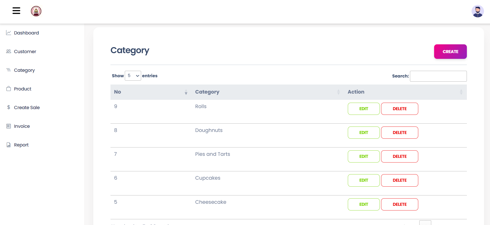
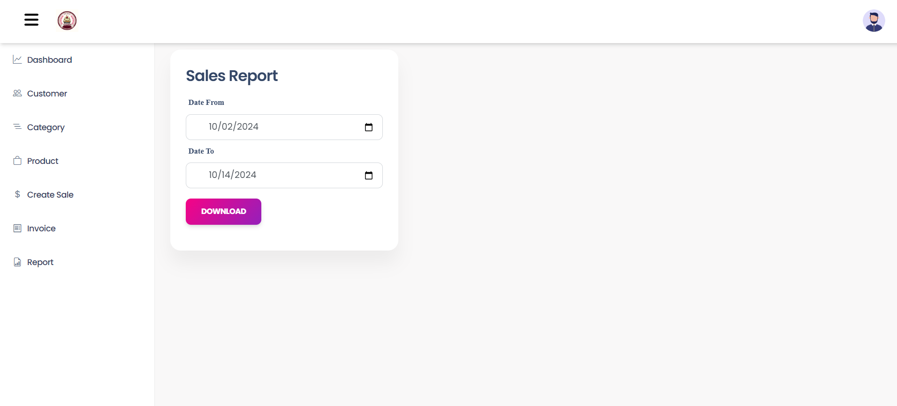

# Ovenza - Bakery Inventory Management System

Ovenza is a bakery inventory management system built with Laravel, providing a user-friendly interface for managing bakery items, sales, and reports.

## Features

- User registration and login
- Two-factor authentication (OTP verification)
- Dashboard overview of sales and inventory
- Manage categories, customers, and products
- Create and manage invoices
- Generate sales reports
- Responsive design for mobile and desktop

## Screenshots


*User Login Overview*


*Dashboard Overview*


*Customer Interface*


*Category Interface*


*Product Interface*


*Create Sale Page*


*Invoice Page*


*Sales Report Page*


*Sales Report PDF Page*


## Installation

To install Ovenza, follow these steps:

1. Clone the repository:

   ```bash
   git clone https://github.com/yourusername/ovenza.git
   ```

2. Navigate to the project directory:

   ```bash
   cd ovenza
   ```

3. Install dependencies:

   ```bash
   composer install
   ```

4. Copy the example environment file and generate the application key:

   ```bash
   cp .env.example .env
   php artisan key:generate
   ```

5. Set up your database and update the `.env` file with your database credentials.

6. Run the migrations:

   ```bash
   php artisan migrate
   ```

7. Start the server:

   ```bash
   php artisan serve
   ```

Now you can access the application at `http://localhost:8000`.

## Usage

1. Register a new user account or log in with an existing account.
2. Use the dashboard to view summaries of sales and inventory.
3. Manage categories, customers, and products through their respective sections.
4. Create invoices and generate sales reports as needed.

## Contributing

Contributions are welcome! Please read the [contributing guide](https://laravel.com/docs/contributions) to learn how to get started.

## License

The Ovenza project is open-sourced software licensed under the [MIT license](https://opensource.org/licenses/MIT).

## Acknowledgments

- Thanks to the Laravel community for their extensive documentation and support.
- Special thanks to [Laravel sponsors](https://partners.laravel.com) for their contributions to the framework's development.
